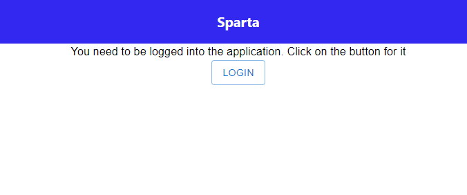
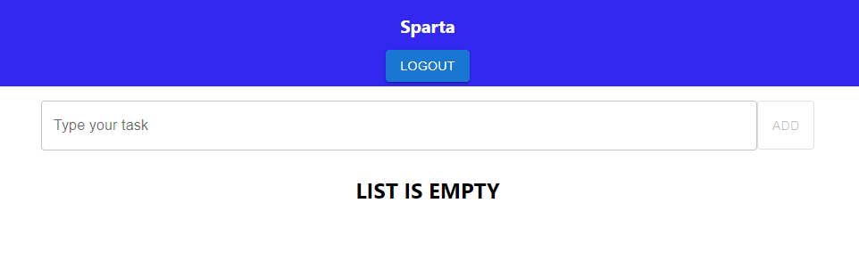
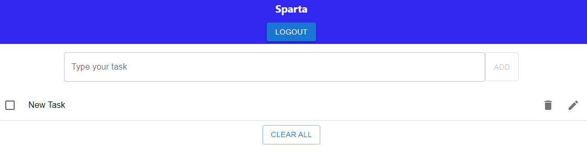
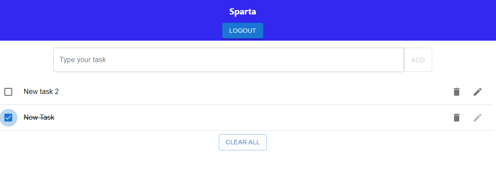
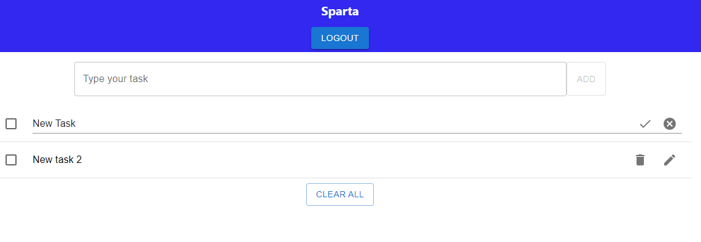

# Sparta TODO app

This project is a TODO app created wit React and redux technologies.

## Available Scripts

In the project directory, you can run:

### `npm start`

Runs the app in the development mode.\
Open [http://localhost:3000](http://localhost:3000) to view it in the browser.

The page will try to open [http://localhost:3000](http://localhost:3000) but you will redirected to [http://localhost:3000/login](http://localhost:3000/login) if you are not logged in (checking localStorage). 

### `npm test`

Launches the test runner in the interactive watch mode.

## Technologies used

This app has been developed using react, redux (@reduxjs/toolkit) and MUI components. Redux state is typically organized into "slices", defined by the reducer. In this example we have auth and task slices. I used scss only in Header file, using a constant file with some variables. The rest of the components are using sx property from MUI to modify the normal behaviour.

## Using the application

### Login

When you start the application (without having token in localStorage), you'll see login page:

Normally, you would have a form here, but for testing purpouses we only have a button here. 

When a user click in the button, an action is sent and the user is logged in (localStorage store a token). If you refresh the web, token will be detected and user will be logged in again. 

### Adding tasks

Firstly, you'll see an empty list of components. If you write a text in the inpuit and click in the "Add" button, a new list will be created.

You have several actions with this tasks:
- **Remove:** Removes the task
- **Edit:** Change the title of the task (open an input to modify the value)
- **Mark task as done**: Check task as done and move to the bottom
- **Clear All:** Removes all the tasks

### Check task as done

When you click in the checkbox, task will be marked as done and moved to the bottom. You can click again and remove the done state. Task will be moved to the top of the list.

### Edit a task

When you click in edit button, a new input will be shown and the icons will change:

You only need to change the title and click in the done icon. If you click cancel button, changes will be discarted.